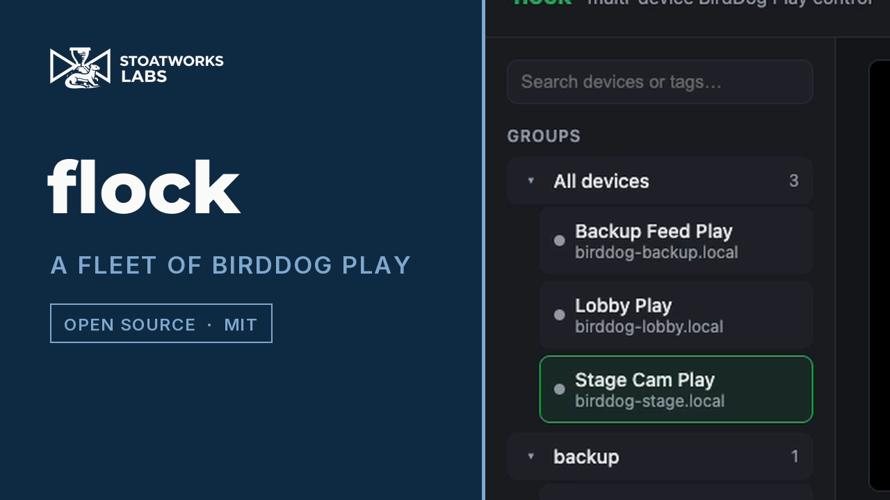
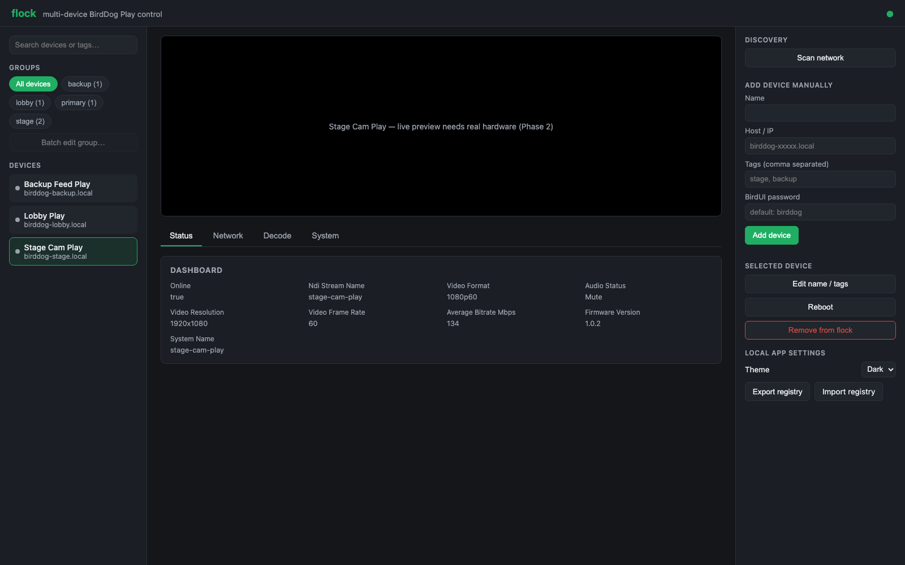
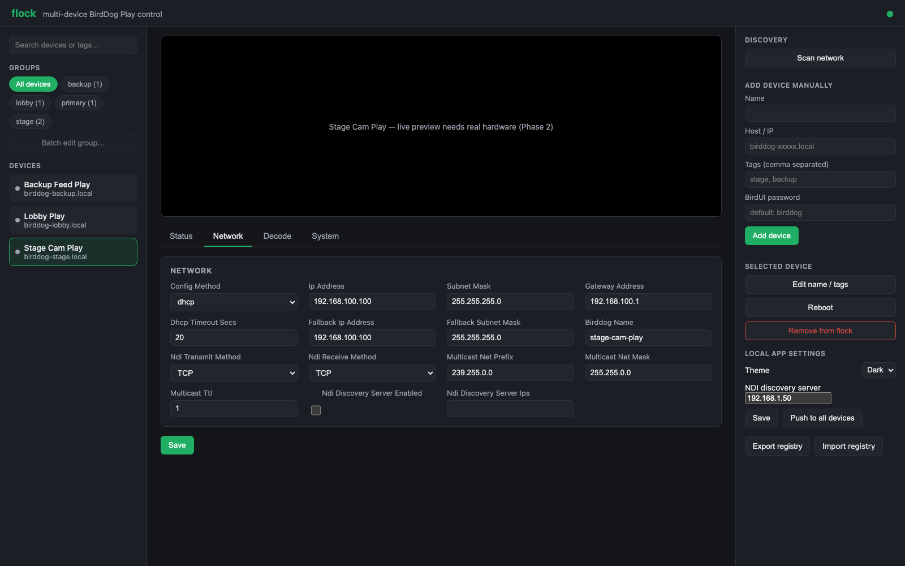
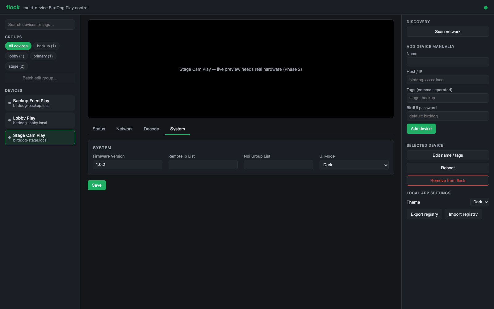
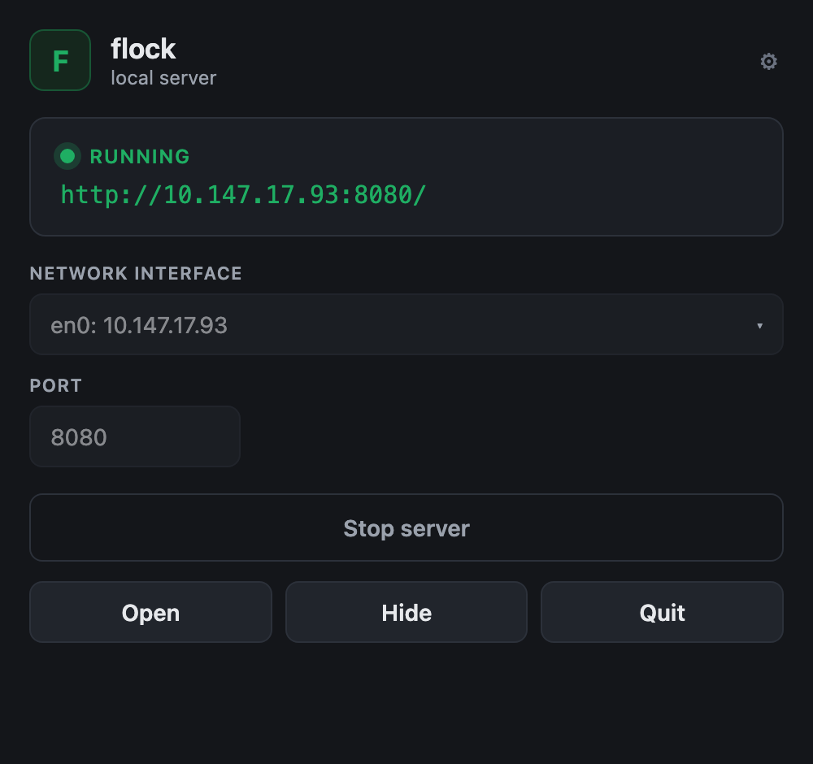
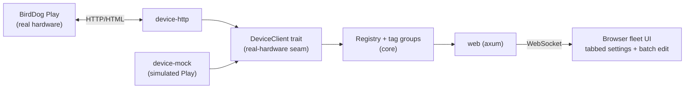

# flock

> **AI-assisted project.** This codebase was created with
> [Claude](https://claude.com/claude-code) (Anthropic), directed and
> reviewed by a human author. Treat this as an early-stage hobby project:
> it's been exercised end-to-end against both a simulated BirdDog Play
> device and a real one — including live reads and a real settings write
> (routing an actual NDI source to a physical unit's HDMI output) — see
> [Status](#status) below for exactly what that covers and what's still
> unverified.

A single web UI for managing any number of [BirdDog Play](https://birddog.tv/play-overview/)
NDI/SRT decoders — a fleet control panel for devices that otherwise only
have their own individual [BirdUI](https://birddog.tv/birdui-overview/) web
interface. Discover Play units on the LAN or add them manually, tag each
into (multiple) groups, see/change every BirdUI setting for a selected
device from one un-nested, tabbed view, or push a setting to an entire
group at once.

<!-- downloads:start -->

## Download

**[v0.1.3](https://github.com/stoatworks-labs/flock/releases/tag/v0.1.3)** — prebuilt for macOS, Windows and Linux. Pick your platform:

<details>
<summary><b>macOS</b> — Apple Silicon, Intel</summary>

| Build | Download | Size |
| --- | --- | --- |
| Apple Silicon · .dmg disk image (CLI) | [`flock-0.1.3-macos-aarch64-cli.dmg`](https://github.com/stoatworks-labs/flock/releases/download/v0.1.3/flock-0.1.3-macos-aarch64-cli.dmg) | 4.2 MB |
| Intel · .dmg disk image (CLI) | [`flock-0.1.3-macos-x86_64-cli.dmg`](https://github.com/stoatworks-labs/flock/releases/download/v0.1.3/flock-0.1.3-macos-x86_64-cli.dmg) | 4.3 MB |
| .dmg disk image (app) | [`flock-0.1.3-macos-app.dmg`](https://github.com/stoatworks-labs/flock/releases/download/v0.1.3/flock-0.1.3-macos-app.dmg) | 7.5 MB |
| Apple Silicon · .pkg installer (CLI) | [`flock-0.1.3-macos-aarch64-cli.pkg`](https://github.com/stoatworks-labs/flock/releases/download/v0.1.3/flock-0.1.3-macos-aarch64-cli.pkg) | 3.7 MB |
| Intel · .pkg installer (CLI) | [`flock-0.1.3-macos-x86_64-cli.pkg`](https://github.com/stoatworks-labs/flock/releases/download/v0.1.3/flock-0.1.3-macos-x86_64-cli.pkg) | 3.8 MB |
| .pkg installer (app) | [`flock-0.1.3-macos-app.pkg`](https://github.com/stoatworks-labs/flock/releases/download/v0.1.3/flock-0.1.3-macos-app.pkg) | 6.8 MB |
| Apple Silicon · .tar.gz archive | [`flock-macos-aarch64.tar.gz`](https://github.com/stoatworks-labs/flock/releases/latest/download/flock-macos-aarch64.tar.gz) | 3.7 MB |
| Intel · .tar.gz archive | [`flock-macos-x86_64.tar.gz`](https://github.com/stoatworks-labs/flock/releases/latest/download/flock-macos-x86_64.tar.gz) | 3.8 MB |

</details>

<details>
<summary><b>Windows</b> — x64, ARM64</summary>

| Build | Download | Size |
| --- | --- | --- |
| x64 · .exe installer | [`flock-0.1.3-windows-x86_64-setup.exe`](https://github.com/stoatworks-labs/flock/releases/download/v0.1.3/flock-0.1.3-windows-x86_64-setup.exe) | 2.6 MB |
| x64 · .exe installer | [`flock_0.1.3_x64-setup.exe`](https://github.com/stoatworks-labs/flock/releases/download/v0.1.3/flock_0.1.3_x64-setup.exe) | 4.5 MB |
| ARM64 · .exe installer | [`flock-0.1.3-windows-aarch64-setup.exe`](https://github.com/stoatworks-labs/flock/releases/download/v0.1.3/flock-0.1.3-windows-aarch64-setup.exe) | 2.4 MB |
| x64 · .msi installer | [`flock_0.1.3_x64_en-US.msi`](https://github.com/stoatworks-labs/flock/releases/download/v0.1.3/flock_0.1.3_x64_en-US.msi) | 6.6 MB |
| x64 · .zip archive | [`flock-windows-x86_64.zip`](https://github.com/stoatworks-labs/flock/releases/latest/download/flock-windows-x86_64.zip) | 3.3 MB |
| ARM64 · .zip archive | [`flock-windows-aarch64.zip`](https://github.com/stoatworks-labs/flock/releases/latest/download/flock-windows-aarch64.zip) | 3.1 MB |

</details>

<details>
<summary><b>Linux</b> — x64, ARM64</summary>

| Build | Download | Size |
| --- | --- | --- |
| x64 · .deb package (Debian/Ubuntu) | [`flock_0.1.3_amd64.deb`](https://github.com/stoatworks-labs/flock/releases/download/v0.1.3/flock_0.1.3_amd64.deb) | 8.4 MB |
| ARM64 · .deb package (Debian/Ubuntu) | [`flock_0.1.3_arm64.deb`](https://github.com/stoatworks-labs/flock/releases/download/v0.1.3/flock_0.1.3_arm64.deb) | 4.2 MB |
| x64 · .rpm package (Fedora/RHEL) | [`flock-0.1.3-1.x86_64.rpm`](https://github.com/stoatworks-labs/flock/releases/download/v0.1.3/flock-0.1.3-1.x86_64.rpm) | 4.2 MB |
| ARM64 · .rpm package (Fedora/RHEL) | [`flock-0.1.3-1.aarch64.rpm`](https://github.com/stoatworks-labs/flock/releases/download/v0.1.3/flock-0.1.3-1.aarch64.rpm) | 4.4 MB |
| x64 · AppImage | [`flock_0.1.3_amd64.AppImage`](https://github.com/stoatworks-labs/flock/releases/download/v0.1.3/flock_0.1.3_amd64.AppImage) | 82 MB |
| x64 · .tar.gz archive | [`flock-linux-x86_64.tar.gz`](https://github.com/stoatworks-labs/flock/releases/latest/download/flock-linux-x86_64.tar.gz) | 4.0 MB |
| ARM64 · .tar.gz archive | [`flock-linux-aarch64.tar.gz`](https://github.com/stoatworks-labs/flock/releases/latest/download/flock-linux-aarch64.tar.gz) | 4.1 MB |

</details>

All builds, checksums and release notes: [github.com/stoatworks-labs/flock/releases](https://github.com/stoatworks-labs/flock/releases).

These builds are unsigned, so macOS and Windows each warn once on first launch — see [Unsigned builds — Gatekeeper, SmartScreen & Defender Firewall](#unsigned-builds--gatekeeper-smartscreen--defender-firewall) for the one-time fix.

<!-- downloads:end -->

## Try the UI

**<https://flock-demo.stoatworks-labs.com>** — flock's real web UI, click-through, in
your browser. It replays responses recorded from flock running against its three
seeded `device-mock` devices, so what you see is output flock actually produced.

Nothing there is live and nothing you change is saved: flock talks to PLAY units
over the LAN, and a hosted page has no devices to reach. To control real
hardware, run it yourself — see [Quick start](#quick-start). How the demo is
built, and the honesty rules it has to keep, are in [demo/README.md](demo/README.md).

## Screenshots

*Real screenshots of flock running locally against the three seeded
`device-mock` devices (see [Status](#status)) — not mockups.*

**Overview** — a nested group tree on the left (a device can sit in more
than one group, and appears under each), preview + settings in the center,
discovery/add/local settings on the right:

[](https://www.youtube.com/watch?v=cMsg6hkjjN0)

*A 45-second tour of the real app against its three seeded `device-mock` devices —
the same simulated fleet the hosted demo records from. No PLAY hardware involved.*


**Status** tab — the per-device dashboard:



**Network** tab — IP config, NDI transmit/receive preferred method,
multicast, and discovery server settings, all in one flat panel:



**Decode** tab — NDI or SRT source selection (toggled per-device),
failover, screensaver, colour space, NDI audio, and tally (Play is
decode-only, so there is no Encode tab). SRT support is new — see
[Status](#status) for what's confirmed against real hardware vs. still a
best guess:


**System** tab — firmware version and Access Manager lists:



**Batch edit** — groups are a nested tree in the left panel; click a
group's header to batch-edit every member at once, or expand it to drill
into an individual device. Every field starts blank/"leave unchanged"; only
fields you actually fill in are sent, merged into each member device's own
current settings rather than overwriting the whole group with a shared
template:


## What it does

- **Device registry**: any number of BirdDog Play devices, each taggable
  into multiple groups (a device isn't locked to one group).
- **Discovery**: an active LAN subnet probe (the actual way a real Play is
  found — it doesn't advertise itself over mDNS at all), manual add-by-host
  as a fallback that always works, and a *separate*, centralized NDI source
  list (mDNS) that suggests values in the Decode tab — flock discovers NDI
  sources once, itself, instead of each Play searching independently, the
  same control-plane-only model real NDI routers (BirdDog's own Keyboard,
  Vizrt's NDI Router) use — see [docs/architecture.md](docs/architecture.md).
- **Full BirdUI parity for Play** (decode-only, so no Encode tab): Status
  (Dashboard), Network, Decode (NDI source + failover, or SRT — caller/
  listener, stream name, IP/port, latency, encryption), and System
  (password/firmware/Access Manager/UI mode) — every field visible directly
  in its tab, nothing behind a submenu.
- **Nested groups, one click to batch-edit**: groups are a vertical tree in
  the left panel (a device can sit in more than one, appearing under each);
  click a group's header to apply a Network/Decode/System change to every
  member at once, or expand it to drill into an individual device. Blank
  fields mean "leave unchanged" — a batch save merges into each device's own
  current settings rather than clobbering the whole group with one shared
  template.
- **NDI Discovery Server, fleet-wide**: set it once in Local App Settings and
  push it to every registered Play's own Network settings in one click
  (flock can't itself query a Discovery Server — no public protocol spec —
  but every Play can, so this configures them to).
- **Live updates**: a WebSocket pushes registry/status changes to every open
  browser tab.
- **Runs in Docker**: `docker compose up` — see the networking note below.

## Status

**Phase 2 (current): validated against both a simulated and a real BirdDog
PLAY.** `crates/device-mock` stands in for hardware for quick iteration/demo;
`crates/device-http` is a real client confirmed against an actual PLAY unit
(firmware 1.0.18) — see [docs/architecture.md](docs/architecture.md)'s
"Confirmed against real hardware" section for exactly what that means and
its known limitations.

Working:
- Cargo workspace (`core`/`discovery`/`device-mock`/`device-http`/`web`/
  `flock`), `cargo build`/`clippy`/`test` all clean, including offline unit
  tests for the real HTML scraper against fixtures captured from actual
  hardware
- Three-pane UI: device list + tag-derived groups on the left, preview +
  tabbed settings in the center, discovery/add/remove/local settings on the
  right
- Every settings tab round-trips against the mock device, single-device or
  batched across a whole group
- Reads (`status`/`network_settings`/`decode_settings`) **and** a real
  settings write both verified live against physical hardware — routed an
  actual NDI source to a real Play's HDMI output through flock's own API,
  read the change back, switched it twice more. Along the way, found (by
  testing, not guessing) that the decode-source picker needed a separate
  JSON API on port 8080 and a specific button field the server silently
  ignores requests without — see [docs/architecture.md](docs/architecture.md)
- Subnet-probe + mDNS discovery scan + manual add/edit/remove
- `docker-compose.yml` with host networking (needed for the subnet probe and
  mDNS alike)
- Device passwords are encrypted at rest (AES-256-GCM, auto-generated key
  file) — `registry.json` itself never holds a plaintext password, and a
  pre-existing plaintext registry.json migrates transparently on its next
  save. See [docs/architecture.md](docs/architecture.md#credentials-are-encrypted-at-rest-transparently)
- SRT decode support (the operator's real Play gained this after a firmware
  update mid-development): switching a device between NDI/SRT source mode is
  confirmed working live, including the real HTML field names. Actually
  applying a manually-typed SRT connection is a separate mechanism (a JSON
  API on port 8080, reverse engineered from BirdUI's own JS) that's
  implemented but was observed unreliable (times out) in live testing —
  deliberately non-fatal, so it can never block the rest of a decode save —
  see [docs/architecture.md](docs/architecture.md#srt-decode-support---confirmed-live-apply-mechanism-partially-unreliable)
- Optional auth for flock itself — off by default (unchanged trusted-LAN
  behavior), but setting `admin_password` in `config/flock.toml` gates the
  whole UI/API behind a single shared login, with brute-force lockout on the
  login endpoint. See
  [docs/architecture.md](docs/architecture.md#flocks-own-auth-is-optional-off-by-default)
- **Live preview — genuinely live, not a snapshot — for SRT decode sources**
  (in caller/rendezvous mode). flock dials the same `srt://` source the
  device itself decodes from and streams it into the browser via ffmpeg;
  along the way, found that modern Chrome doesn't reliably render
  `multipart/x-mixed-replace` through a plain `` any more, so the
  frontend parses the stream itself and swaps in a fresh frame per `blob:`
  URL instead. Requires an `ffmpeg` with SRT input support on `PATH` (most
  default packages lack this — see below). NDI preview stays a placeholder
  on purpose — no open decoder exists without the proprietary NDI SDK. See
  [docs/architecture.md](docs/architecture.md#live-srt-preview)

Not yet done:
- Live NDI preview (no open decoder without the proprietary NDI SDK — see above)
- Actually applying a manually-entered SRT source — see above, the real
  device-side mechanism hasn't behaved reliably in testing yet

## Quick start

```bash
cargo run -p flock
```

Then open `http://localhost:8080`. On first run with an empty registry it
seeds three demo devices so there's something to look at immediately.
Everything works without it, but if you want the live SRT preview,
`ffmpeg` needs to be on `PATH` — specifically a build with SRT input
support, which most default packages (including plain Homebrew `ffmpeg` on
macOS) lack; see [docs/architecture.md](docs/architecture.md#live-srt-preview).

### Docker

```bash
docker compose up --build
```

Uses `network_mode: host` so both discovery mechanisms (the subnet probe and
mDNS) can reach the LAN from inside the container — see
[docs/architecture.md](docs/architecture.md#docker--networking) for the
tradeoff and the bridge-networking alternative if you'd rather keep
container isolation and rely on manual add only. The image installs
`ffmpeg` for the live SRT preview, but whether Debian's package has SRT
input support is unconfirmed — check with
`docker compose exec flock ffmpeg -protocols | grep srt` if the preview
isn't working.

### Desktop app

Prefer not to touch the terminal? A small menu-bar app lets you pick the network
interface + port, Start/Stop the server, and open the web UI. The `flock` server
is bundled inside, so it's a single download — nothing to install or wire up.
Grab the `.dmg` from [Releases](https://github.com/stoatworks-labs/flock/releases),
or see [launcher/](launcher/) to build it. It doesn't bundle `ffmpeg`, so the
live SRT preview needs one on the host machine's `PATH` independently.

<p align="center"></p>

## Architecture



See [docs/architecture.md](docs/architecture.md) for the crate layout, the
`DeviceClient` trait that isolates real-hardware integration to one seam,
and the full list of what's confirmed against real hardware vs. still
unconfirmed/unimplemented.

## Unsigned builds — Gatekeeper, SmartScreen & Defender Firewall

The release binaries are **not code-signed or notarized** — that needs paid Apple
and Microsoft developer certificates this project doesn't carry. The downloads are
fine; the OS just can't identify the publisher, so it warns you the first time.

- **macOS** — *"cannot be opened because the developer cannot be verified"*.
  Right-click the app → **Open** → **Open**, or clear the flag:
  `xattr -dr com.apple.quarantine "/Applications/flock.app"`
- **Windows** — SmartScreen shows *"Windows protected your PC"* →
  **More info** → **Run anyway**.
- **Windows Defender Firewall** — first launch pops *"Allow flock to communicate on
  these networks"*. Tick **Private** (and **Domain** on a managed network) — flock needs
  it to serve the web UI and find BirdDog decoders by broadcast discovery on your LAN.
  Deny it and discovery will come back empty and the UI won't be reachable from another
  machine.
- **Linux** — no signing gate.

Per-artifact steps, self-signing, checksum verification and the Defender Firewall reset
procedure: **[docs/UNSIGNED.md](docs/UNSIGNED.md)**.

## Roadmap / TODO

Full plan in [docs/roadmap.md](docs/roadmap.md). Next up:

- [ ] **Subscribe to the real device's live status WebSocket** instead of polling `/dashboard`.
- [ ] **Real live video preview** — an actual NDI/SRT frame grab (currently a placeholder).

## Trademarks and third-party licences

**NDI® is a registered trademark of Vizrt NDI AB.** See <https://ndi.video>.
This project is not affiliated with or endorsed by Vizrt.

The NDI runtime is obtained separately under Vizrt's own terms and is not
redistributed here. NDI Tools are not redistributed either — get them from
<https://ndi.video/tools>.

H.264, H.265 and AAC are separately licensable formats. The NDI SDK grant does
not cover them, and the obligation sits with whoever ships a product using them.
