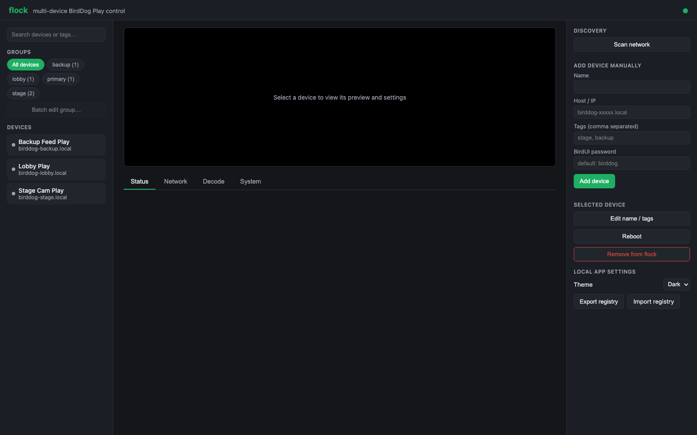
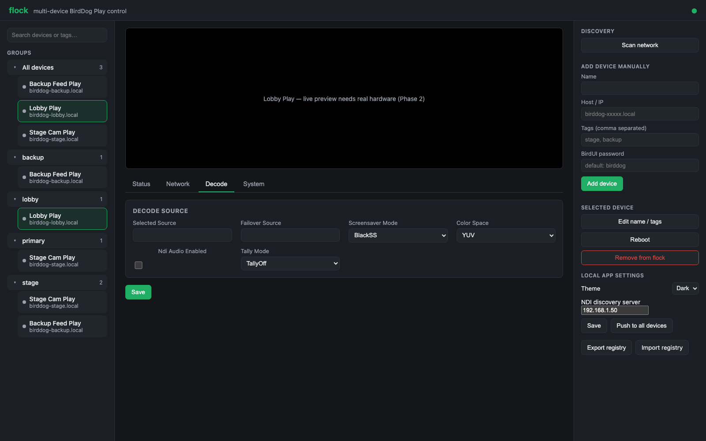
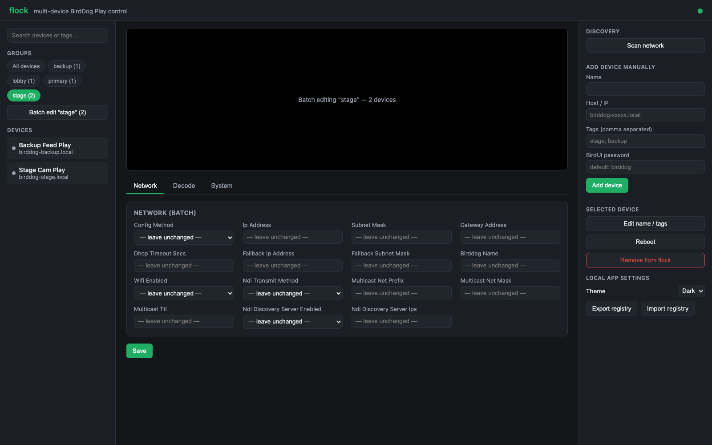

# flock user guide

flock gives you **one control panel for every BirdDog Play decoder you own**.

Out of the box each Play has its own BirdUI web page — fine for one unit, painful for twenty.
flock discovers them all, shows them in one place, and lets you change settings across a whole
group at once.

> **Before you rely on this:** flock has been used against **both a simulated device and a real
> one**, including live reads and a **real settings write** — routing an actual NDI source to a
> physical unit's HDMI output. That is stronger evidence than most tools of this kind carry. It is
> still an early-stage project, and a successful write on one path is not proof of every path;
> the README's Status section defines exactly which operations are covered.

---

## Getting started

1. Run flock — as its own desktop tray app, or `cargo run -p flock`.
2. Open the web UI.
3. **Scan network** — flock probes the local subnet for Play devices.
4. Add the ones you want to manage. Each needs its BirdUI password.

Passwords are **encrypted before being written to disk**, and never returned by the API once
stored. If you need to change one, re-enter it — you cannot read back what is there.

Devices can also be added by hand — name, host, tags and password — which is the route to take
when a unit is on another subnet and discovery can't reach it.

---

## Per-device settings

Select a device and you get its tabs:

| Tab | What it covers |
|---|---|
| **Status** | Is it up, and what is it doing |
| **Decode** | Which NDI or SRT source it is playing. **The one you will use most.** |
| **Network** | Addressing, NDI transmit/receive method, multicast, discovery server |
| **System** | Device-level settings |

Plus **Reboot**, **Edit name / tags**, and a preview of the output.

---

## Groups — the point of flock

Tag your devices by room, by hall, by purpose. Tags become groups in the sidebar, and a device can
be in several. Select a **group** rather than a device and the settings tabs become batch editors.

**Every field defaults to `— leave unchanged —`.** That is the safety property that makes group
editing usable: you set the two fields you mean to change, and the other fourteen are not touched
on any device in the group.

> **Save writes to every device in the group at once.** Check what is in a tag before you fire a
> group operation — a mistake here is multiplied by the size of the group, and these are decoders
> driving screens people may be watching.

**Export registry** and **Import registry** move your whole device list and tagging between
machines, which is how a show file for a rig gets carried from the office to site.

---

## Locking it down

By default flock has **no login**, on the assumption it is on a trusted production LAN.

To require a password, set `admin_password` under `[web]` in the config. Then every page and API
call needs a session. Two things to know:

- **Sessions live in memory only.** Restarting flock logs everyone out. That is intentional for a
  single-operator tool.
- **After 5 failed logins there is a 30-second lockout**, applied **process-wide** rather than per
  client — there is only one password, so a client guessing wrong briefly pauses everyone's next
  attempt.

Even with a password set, flock is designed for a **trusted operations network**. Don't put it on
the public internet.

---

## Troubleshooting

| Symptom | Cause |
|---|---|
| **Scan finds nothing** | flock and the devices must be on the same subnet. Discovery is a subnet probe, so it will not cross a router. Check for a firewall, and for client isolation on wireless. |
| **A device shows unreachable after working** | Its IP probably changed. Check the Network tab, or re-scan. |
| **A settings write is rejected** | Usually a wrong or changed BirdUI password. Re-enter it on the device. |
| **I can't see the password I entered** | By design — redacted in every response and encrypted on disk. |
| **A group save changed fields I didn't touch** | Shouldn't happen: unset fields are `— leave unchanged —`. Worth reporting. |
| **Everyone got logged out** | flock restarted. Sessions are in-memory. |
| **Login says I'm locked out** | Five failed attempts triggers a 30-second cooldown, process-wide. Wait it out. |

---

## A note on care

flock writes settings to **real decoders on a live network**. A bad decode change doesn't fail a
test — it can black out a screen in front of an audience.

Prefer reading before writing, check group membership before group operations, and if you are
developing against flock rather than operating it, use the mock device backend instead of real
hardware.

---

## See also

- [API.md](API.md) — the HTTP surface
- [architecture.md](architecture.md) — the device trait and the adapters behind it
- [DEVELOPING.md](DEVELOPING.md) · [diagnostics.md](diagnostics.md) · [roadmap.md](roadmap.md)
- [README](../README.md) — status, coverage and downloads
